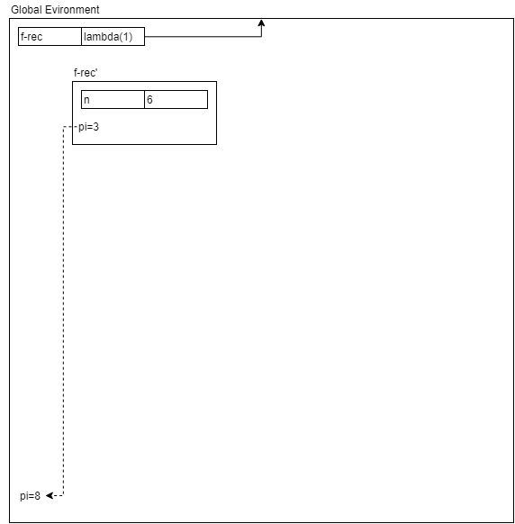

---
author: 
- William Findlay
title: 3007 Final Exam Review 
date: \today
bibliography: /home/housedhorse/.bibs/uni.bib
csl: /home/housedhorse/.bibs/ieee.csl
header-includes:
  \usepackage{float}
  \let\origfigure\figure
  \let\endorigfigure\endfigure
  \renewenvironment{figure}[1][2] {
      \expandafter\origfigure\expandafter[H]
  } {
      \endorigfigure
  }
output:
  pdf_document:
    number_sections: true
    fig_crop: true
    fig_caption: true
    keep_tex: false
---
\newpage
\tableofcontents
\newpage

# Definitions
Define the following terms and provide examples or sample code as appropriate.

## Imperative vs Declarative
### Imperative
- Series of instructions
- Iterative functions
- Command driven, statement oriented
- Procedural
  - C
  - Pascal
  - Assembly
- Object oriented
  - C++
  - Java

### Declarative
- No side effects
- Focus on relations
- "What to get" instead of "How to get"
- Order of statements *shouldn't* matter
- Examples:
  - SQL
  - Prolog
  - Regex

## Scope vs Visibility
### Scope
- The set of expressions for which the variable *exists*
- In lexical scoping
  - variables in the scope we were *defined* in
  - and local variables
  - who uses this?
    - C-family languages
    - Scheme
    - Algol
- In dynamic scoping
  - variables in the scope we were *called* in
  - and local variables
  - who uses this?
    - early LISP
    - APL
    - BASH

### Visibility
- The set of expressions for which the variable *can be reached*
- If we **declare a local variable** with the *same name* as a variable in enclosing scope
  - that enclosing scope variable is now hidden
  - all references to *name* are to our locally scoped variable instead

## Lexical Scope vs Dynamic Scope
### Lexical
- Function scope is enclosed in the scope which *defined us*
  - if you can't find a binding, recursively search in the function that defined you

### Dynamic
- Function scope is enclosed in the scope which *called us*
  - if you can't find a binding, recursively search in the function that called you

## Free Variables
- **Used locally** but **bound in an enclosing scope**
- In the following example:
  ```{Scheme}
  (define (f x y)
    (define z 2)
    (define (g)
      (* x y z)
    )
  )
  ```
  - `x,y,z` are free variables in `(g)`
  - `(g)` *looks them up* in its *enclosing scope*, `(f)`

## Applicative Order Evaluation vs Normal Order Evaluation
### Applicative Order Evaluation
- **Strict evaluation**
- Evaluate an expression *before* it is passed in as an argument
  - go as deep as you can until you hit primitives, then evaluate and go back
  - as deep into the nest as possible and work backwards
  - e.g.,
    ```{Scheme}
    (double (* (+ 1 3) 4))
    (double (* 4 4))
    (double 16)
    (* 16 2)
    32
    ```

### Normal Order Evaluation
- **Lazy evaluation**
- Evaluate an expression *only* when its value is needed
  - first **expand**, then **reduce**
  - e.g.,
    ```{Scheme}
    (double (* (+ 1 3) 4))
    (* (* (+ 1 3) 4) 2)
    (* (* 4 4) 2)
    (* 16 2)
    32
    ```

## Special Forms
- **Exceptions** to the usual evaluation order
  - they have their own evaluation rules
  - e.g., take the first argument without evaluating right away, evaluate the second symbol right away
- Use constructs like `(delay foo)`, `(force foo)` behind the scenes

## Tail Recursion
- **Linear iterative processes** in Scheme
- No *deferred operations*
  - **recusrive call** is the **last operation** of the procedure
- In Scheme, recursion is *tail optimized*
  - this means that it will run in *constant space*
  - number of steps will **grow linearly**, but memory will **remain constant**
- Even though the *program* is still recursive, the *process* is linear iterative because of tail-recursion optimization
- E.g., to compute a factorial using tail recursion, we do the following:
  ```{Scheme}
  (define (factorial x)
    (define (iter prod i)
      (if (> i x)
        prod
        (iter (* i prod) (+ i 1))
      )
    )
    (iter 1 1)
  )
  ```
- To compute a factorial using normal recursion, we would do the following instead:
  ```{Scheme}
  (define (factorial x)
    (if (= x 1)
      x
      (* x (factorial - x 1))
    )
  )
  ```

## First Class and Higher Order Procedures
### First Class Procedures
- When procedures (functions) behave like variables
  - procedures can be *passed as arguments* into other procedures
  - or they can be *returned* from another procedure
- E.g.,
  ```{Scheme}
  (define (f g)
    (g 2)
  )
  (define (h x)
    (+ x 3)
  )
  (f h) ; this would yield (+ 2 3), which evaluates to 5
  ```
- This is how *closures* work
  - more on this in a following subsection

### Higher Order Procedures
- A procedure which *accepts one or more procedure(s)* as argument(s)
- In other words, a procedure which *uses* the **first class procedures** property of a language
- In the above codeblock, `(f g)` is an example of a **higher order procedure**

## Closures
- When a nested function is *returned* by its **enclosing scope**
- In practice, the returned function is typically a `lambda` (anonymous procedure)
- E.g.,
  ```{Scheme}
  (define (multBy x)
    (lambda (y)(* x y)) ; lambda captures the free variable x
  )

  ((multBy 12) 3) ; 36

  (define (double) (multBy 2))
  (define (triple) (multBy 3))

  (double 2) ; 4
  (triple 2) ; 6
  ```

## Abstraction Barriers
- **Hide implementation** within complex procedures
  - user does not need to know how they work
  - they need only be guaranteed that they *will* work
- Prevents pollution of the global namespace
- Prevents excess free variables

## Referential Transparency
- The idea that *references* can be substituted for their values without changing result of an expression
- Purely functional languages are referentially transparent
- Imperative languages are *by definition* **not** referentially transparent

## Clause (Prolog)
- **Facts** and **rules** about the domain
- They specify truths and relations between symbols/entries in the domain
  - facts:
    - `cold(ottawa).`
    - `rainy(ottawa).`
  - rules:
    - `icy(X):- cold(X),rainy(X).`
- **Read from a file** or **asserted** in the REPL with `assert()`
- **Removed** with `retract()`

## Unification (Prolog)
- Prolog attempts to unify variables, atoms, and predicates
  - predicates unify with predicates with the same number of functors and if the functors can be unified
  - variables unify with variables and atoms
  - an atom will always unify with itself
- The query succeeds if all *can be unified*
  - fails otherwise

## Resolution (Prolog)
- *Algorithm* to resolve queries
- The algorithm:
  ```
  Resolve:
    Input:  A query Q and program P
    Output: True if Q can be inferred by P, false otherwise

    Algorithm:
      Start with a goal G, initially set to Q
        Attempt to unify the first subgoal G1 from G

        If no unification possible, then backtrack
          If no backtrack possible, FAIL
        Else, extend the goal G to G' with the following:
          If unified with a rule, substitute G1 with the body of that rule
          If unified with a fact, remove G1 from F

        If G' is empty, SUCCESS
        Else, Resolve G'
  ```
- **If a clause unifies** with a goal, it satisfies the goal
  - a **fact** satisfies the goal immediately
  - a **rule** substitutes subgoals for the original goal
- **Backtracking** here means the following:
  - attempt another clause to satisfy the subgoal
  - if we are out of clauses to try, undo a previously satisfied subgoal and attempt to satisfy it another way
    - if we are out of subgoals, we can fail

# Scheme Comprehension
What is the output of the following expressions/programs?

1. `(+ (* 3 4)(- 5 2 1)(/ 8 2))`  
Output: `18`  
2. `(and (> (+ (* 3 4)(- 5 2 1)(/ 8 2)) 0)(or (= (- 4 5)(+ 3 6 (* 10 -1)))(>= (* (/ 16 4)(+ 1 (* 3 2)(- 31 29)))(+ (* 3 4)(- 5 2 1)(* 8 2)))))`  
Output: `#t`  
3. `(let ((l (+ 2 1))(e (/ 16(* 4 4)))(t (length '(5 7)))) (if (< l e) t 0))`  
Output: `0`  
4. `((lambda (x y) (+ 3 x (* 2 y))) (+ 3 3)(* 2 2))`  
Output: `17`  
5. `(let ((a (lambda (b c)(* b c)))(b 10)(c 5))(+ (a 3 2) b c))`  
Output: `21`  
6. `(define (x y z)((lambda (y z)(- y z)) z y)) (x 3 5)`  
Output: `2`  
7. `(define (foo y) ((lambda (x) y) ((lambda (y)(* y y)) y))) (foo 3)`  
Output: `3`  
8. `(((lambda(x)(lambda(y)(+ x y))) 12) ((lambda(z)(* 3 z)) 3))`  
Output: `21`  
9. `((lambda (a b c)(list '(a b c) (list a b c) a 'b c)) 1 2 3)`  
Output: `((a b c) (1 2 3) 1 b 3)`  
10. `(((lambda (a)(lambda (b) '(lambda (c) '(a b c)))) 1) 2)`  
Output: `(lambda (c) '(a b c))`  
11. `(eval '(let ((a (lambda(x y)(list x y)))(b 2)(c 3))(list (a b 'c) '(a b c)))`  
`(interaction-environment))`  
Output: `((2 c) (a b c))`

# Normal and Applicative Order
Show the substitution model using normal and applicative order for the following examples:

## First Example
```{Scheme}
(define (f x)(+ x (* 2 x)))
(define (g y)(* 10 (f y)))
(g (+ 1 2 3))
```

### Applicative Order
```{Scheme}
(g (+ 1 2 3))
(g 6)
(* 10 (f 6))
(* 10 (+ 6 (* 2 6)))
(* 10 (+ 6 12))
(* 10 18)
180
```

### Normal Order
```{Scheme}
(g (+ 1 2 3))
(* 10 (f (+ 1 2 3)))
(* 10 (+ (+ 1 2 3) (* 2 (+ 1 2 3))))
(* 10 (+ (+ 1 2 3) (* 2 6)))
(* 10 (+ 6 12))
(* 10 18)
180
```

## Second Example
```{Scheme}
(define (abs x)
(if (< x 0) (- x) x))
(define (square x) (* x x))
(define (inc x)(+ x 1))
(+ (abs (- 75 100))(square (inc (abs (* -2 3)))))
```

### Applicative Order
```{Scheme}
(+ (abs -25)(square (inc (abs (* -2 3)))))
(+ (- -25)(square (inc (abs (* -2 3)))))
(+ 25 (square (inc (abs (* -2 3)))))
(+ 25 (square (inc (abs -6))))
(+ 25 (square (inc (- -6))))
(+ 25 (square (inc 6)))
(+ 25 (square (+ 6 1)))
(+ 25 (square 7))
(+ 25 (* 7 7))
(+ 25 49)
74
```

### Normal Order
```{Scheme}
(+ (abs (- 75 100))(square (inc (abs (* -2 3)))))
(+ (- (- 75 100))(square (inc (abs (* -2 3)))))
(+ (- (- 75 100))(* (inc (abs (* -2 3)))(inc (abs (* -2 3)))))
(+ (- (- 75 100))(* (+ (abs (* -2 3)) 1)(+ (abs (* -2 3)) 1)))
(+ (- (- 75 100))(* (+ (- (* -2 3)) 1)(+ (- (* -2 3)) 1)))
(+ (- -25)(* (+ (- (* -2 3)) 1)(+ (- (* -2 3)) 1)))
(+ 25 (* (+ (- (* -2 3)) 1)(+ (- (* -2 3)) 1)))
(+ 25 (* (+ (- -6) 1)(+ (- -6) 1)))
(+ 25 (* (+ 6 1)(+ 6 1)))
(+ 25 (* 7 7))
(+ 25 49)
74
```

# Data Abstraction
```{Scheme}
; make a point
(define (make-point x y)
  (list x y)
)

; define get x of a point
(define (x-point p)
  (car p)
)
; define get y of a point
(define (y-point p)
  (cadr p)
)

; make a line segment
(define (make-segment x1 y1 x2 y2)
  (list (make-point x1 y1) (make-point x2 y2))
)
; get start of segment
(define (start-segment s)
  (car s)
)
; get end of segment
(define (end-segment s)
  (cadr s)
)
; get midpoint of a segment
(define (midpoint-segment s)
  (make-point (/ (+ (x-point (start-segment s))
                    (x-point (end-segment s))) 2)
              (/ (+ (y-point (start-segment s))
                    (y-point (end-segment s))) 2)
              )
)
```

# Lists and Iteration (Scheme)
Implement or answer questions about the following procedures related to lists and iteration in Scheme:

a) Define procedures `map`, `filter`, and `reduce`.
    ```{Scheme}
    (define (map f L)
      (cond
        ((null? L) L)
        (else (cons (f (car L)) (map f (cdr L))))
        )
      )

    (define (filter f L)
      (cond
        ((null? L) L)
        ((f (car L))(cons (car L) (filter f (cdr L))))
        (else (filter f (cdr L)))
        )
      )

    (define (reduce f L init)
      (define (helper v L)
        (cond
          ((null? L) v)
          (else (helper (f v (car L)) (cdr L)))
          )
        )
      (helper init L)
      )
    ```
b) Define a procedure `(last L)` that returns the last element of the list `L`.
    ```{Scheme}
    (define (last L)
      (cond
        ((null? (cdr L)) (car L))
        (else (last (cdr L)))
        )
      )
    ```
c) Define a procedure `(remaining n L)` that returns a list containing all but the first `n` items in the list.
    ```{Scheme}
    (define (remaining n L)
      (cond
        ((null? L) L)
        ((= n 0) L)
        (else (remaining (- n 1) (cdr L)))
        )
      )
    ```
d) Define a procedure `(leading n L)` that returns a list containing ONLY the first `n` items.
    ```{Scheme}
    (define (leading n L)
      (cond
        ((null? L) L)
        ((<= n 0) '())
        (else (cons (car L) (leading (- n 1) (cdr L))))
        )
      )
    ```
e) Define a procedure `reverse` that takes a list as argument and returns a list of the same elements in reverse order.
    ```{Scheme}
    (define (reverse L)
      (define (iter f r)
        (cond
          ((null? f) r)
          (else (iter (cdr f) (cons (car f) r)))
          )
        )
      (iter L '())
      )
    ```
f) Define a procedure `smallest-it` that takes a list of numbers as argument and uses an iterative process to return the smallest item in the list. You may assume the list is non empty.
    ```{Scheme}
    (define (smallest-it L)
      (define (iter L s)
        (cond
          ((null? L) s)
          ((not s) (iter (cdr L) (car L)))
          ((< (car L) s) (iter (cdr L) (car L)))
          (else (iter (cdr L) s))
          )
        )
      (iter L #f)
      )
    ```
g) Define a procedure `smallest-rec` that takes a list of numbers as argument and uses an recursive process to return the smallest item in the list. You may assume the list is non empty.
    ```{Scheme}
    (define (smallest-rec L)
      (define (min x y)
        (if (< x y) x y)
        )
      (if (null? (cdr L))
          (car L)
          (min (car L) (smallest-rec (cdr L)))
          )
      )
    ```
h) Use the substitution model for `(smallest-<it/rec> '(5 3 1 7 4 2))` to show that your answers to the previous two questions are recursive/iterative.
    i) Substitution model for `(smallest-it '(5 3 1 7 4 2))`:
        ```{Scheme}
        (smallest-it '(5 3 1 7 4 2))
        (iter '(5 3 1 7 4 2) #f)
        (iter '(3 1 7 4 2) 5)
        (iter '(1 7 4 2) 3)
        (iter '(7 4 2) 1)
        (iter '(4 2) 1)
        (iter '(2) 1)
        (iter '() 1)
        1
        ```
    ii) Substitution model for `(smallest-rec '(5 3 1 7 4 2))`:
        ```{Scheme}
        (smallest-rec '(5 3 1 7 4 2))
        (min 5 (smallest-rec '(3 1 7 4 2)))
        (min 5 (min 3 (smallest-rec '(1 7 4 2))))
        (min 5 (min 3 (min 1 (smallest-rec '(7 4 2)))))
        (min 5 (min 3 (min 1 (min 7 (smallest-rec '(4 2))))))
        (min 5 (min 3 (min 1 (min 7 (min 4 (smallest-rec '(2)))))))
        (min 5 (min 3 (min 1 (min 7 (min 4 2)))))
        (min 5 (min 3 (min 1 (min 7 2))))
        (min 5 (min 3 (min 1 2)))
        (min 5 (min 3 1))
        (min 5 1)
        1
        ```
i) Define a procedure `makeChange` that takes a `cost` and a `payment` as arguments and returns a list of change in the following format: `(dollars quarters dimes nickels pennies)`. *Note*: You can cast a floating point number to an integer using: `(inexact->exact (floor floatNum))`. 
    ```{Scheme}
    (define (makeChange c p)
      (define (iter t d)
        (if (null? d)
            '()
            (cons (inexact->exact (floor (/ t (car d))))
                  (iter (modulo t (car d)) (cdr d))
                  )
            )
        )
      (if (< p c)
          "Insufficient funds!"
          (iter (* (- p c) 100) '(100 25 10 5 1))
          )
      )
    ```
j) Define a recursive procedure called `(subsets x)` that takes a list as a single argument and returns all $2^n$ subsets of that list, i.e., the *powerset* of the list (order is not important).
    ```{Scheme}
    (define (subsets x)
      (if (null? x) '(())
          (append  (subsets (cdr x))
                   (map (lambda (y) (append (list (car x)) y))
                        (subsets (cdr x))
                        )
                   )
          )
      )
    ```
k) 
Define a procedure called `(treemerge t1 t2)` that takes two trees (arbitrarily nested lists) and returns the result of merging the two trees using the following guidelines:
    - Merging two trees is done by recursing through their structure and multiplying their subtrees
      - The root of `t1` is merged with the root of `t2`
      - The first child is merged with the first child
      - Second with second... etc, etc, etc, ...
    - Merging two leaf nodes is done by multiplying their values (you may assume they are numbers).
    - Merging a leaf node with a subtree is done by scaling the subtree by the value of the leaf.
    - Merging a subtree with an empty tree, is simply the non-empty subtree.
    ```{Scheme}
    (define (tree-scale c t)
      (cond
        ((null? t) '())
        ((list? (car t)) (cons (tree-scale c (car t)) (tree-scale c (cdr t))))
        (else (cons (* c (car t)) (tree-scale c (cdr t))))
        )
      )

    (define (tree-merge t1 t2)
      (cond
        ((null? t1) t2)
        ((null? t2) t1)
        ((and (list? (car t1)) (list? (car t2))) (cons (tree-merge (car t1) (car t2))
                                                       (tree-merge (cdr t1) (cdr t2))))
        ((and (number? (car t1)) (list? (car t2))) (cons (tree-scale (car t1) (car t2))
                                                         (tree-merge (cdr t1) (cdr t2))))
        ((and (list? (car t1)) (number? (car t2))) (cons (tree-scale (car t2) (car t1))
                                                         (tree-merge (cdr t1) (cdr t2))))
        (else (cons (* (car t1) (car t2)) (tree-merge (cdr t1) (cdr t2))))
        )
      )
    ```

# Streams
This will not be on this year's final exam. We can safely forget it exists.

# Contour Diagrams
## First Example
Given the following code, draw contour diagrams at each stage in the recursion (i.e., one diagram each time it reaches line `03`).
```{Scheme}
01| (define (f n)
02|   (define (iter n1 n2 n3 n4 count)
03|    (if (> count n) n1
04|    	(iter (+ (* 4 n1) (* 3 n2) (* 2 n3) (* 1 n4)) n1 n2 n3 (+ count 1))))
05|   (if (< n 4) n
06|      (iter 3 2 1 0 4)))
07| (define r (f 6))
```

{height=44%}

{height=44%}

{height=44%}

{height=44%}

## Second Example
Given the following code, draw contour diagrams for each non-base-case stage in the recursion (i.e., one diagram each time it reaches line `03`). Then do the same for **dynamic scoping** instead of lexical scoping. Does the output of the code change? Why or why not?
```{Scheme}
01| (define (f-rec n)
02|   (if (< n 4) n
03|      (+ (* 4 (f-rec (- n 1)))
04|         (* 3 (f-rec (- n 2)))
05|         (* 2 (f-rec (- n 3)))
06|         (* 1 (f-rec (- n 4)))
07|         )))
08| (define r (f-rec 6))
```

### Lexical Scoping

{height=44%}

{height=44%}

{height=44%}

### Dynamic Scoping

{height=40%}

{height=40%}

{height=44%}

### Does the Output Change?
The output does not change because there are no free variables. The difference between lexical and dynamic scoping is primarily the way they deal with free variables.

## Third Example
Given the following code:
```{Scheme}
01| (define (boxcar a b h)
02|		(lambda(x)(if (and (>= x a)(<= x b)) h 0)))
03|
04| (define f1 (boxcar 5 10 1))
05| (define f2 (boxcar 1 3 20))
06| (define result1 (f1 6))
07| (define result2 (f2 6))
```
Draw contour diagrams for the following points of execution:

{height=44%}

{height=44%}

{height=44%}

{height=44%}

## Fourth Example
Using your implementation of `make-list` from assignment 4, draw contour diagrams at the following points in this code:
```{Scheme}
01-60|  ; your list implementation here...
61| (define L1 (make-list))
62| ((L1 'add) 0 'a)
63| ((L1 'add) 1 'b)
64| ((L1 'add) 0 'c)
65| ((L1 'set) 2 'd)
66| (define len ((L1 'size)))
```

{height=44%}

{height=44%}

{height=44%}

{height=44%}

{height=44%}

## Fifth Example
Draw contour diagrams for the various points in the execution of the following code:
```{Scheme}
01|	(define (triple x y z)
02|	  (lambda (m) (m x y z))) 
03|	(define (first t)
04|	  (t (lambda (x y z) x)))
05|	(define (second t)
06|	  (t (lambda (x y z) y)))
07|	(define (third t)
08|	  (t (lambda (x y z) z)))
09|	(define a1 (triple 1 2 3))
10|	(define a2 (triple 4 5 6))
11|	(first a1)
12|	(define a3 (second a2))
13|	(define a4 (triple a1 a2 a3))
```

{height=42%}

{height=42%}

{height=42%}

{height=42%}

{height=42%}

{height=42%}

{height=42%}

# Meta-Circular Interpreter

# Prolog
